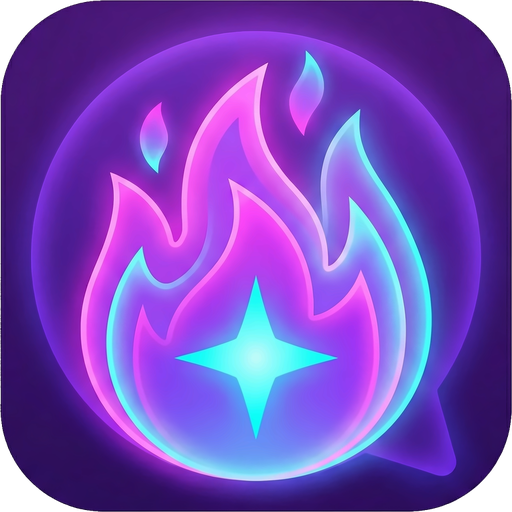
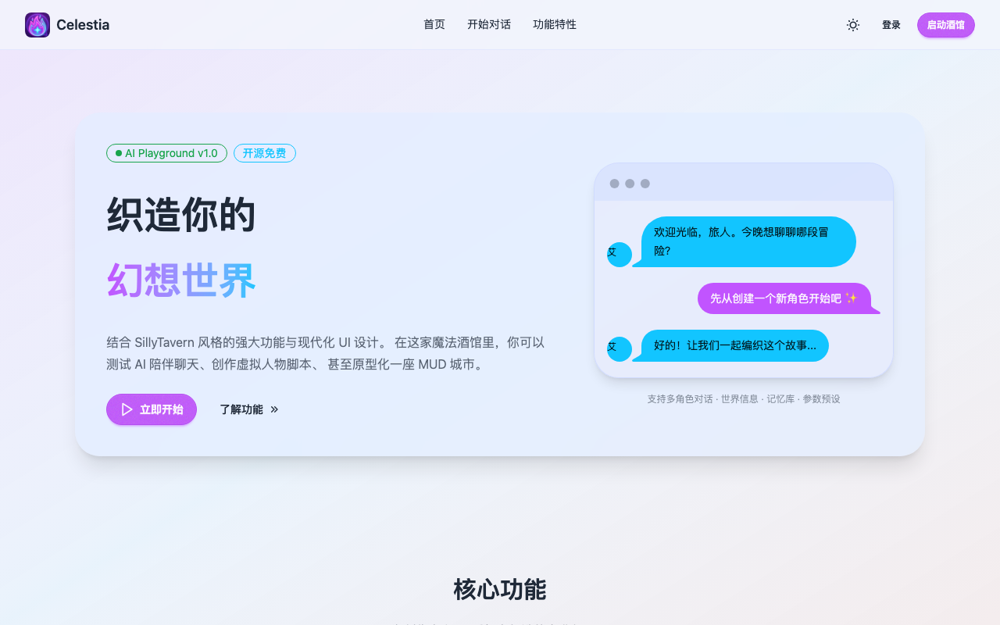
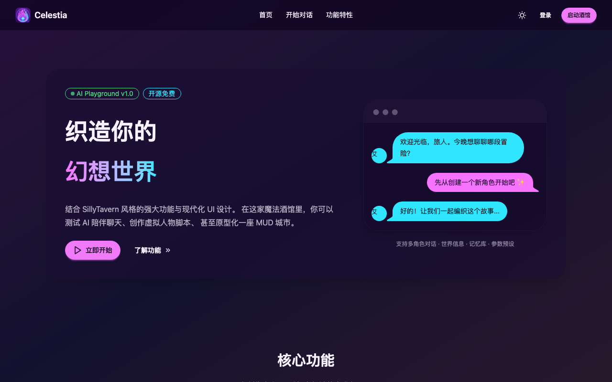
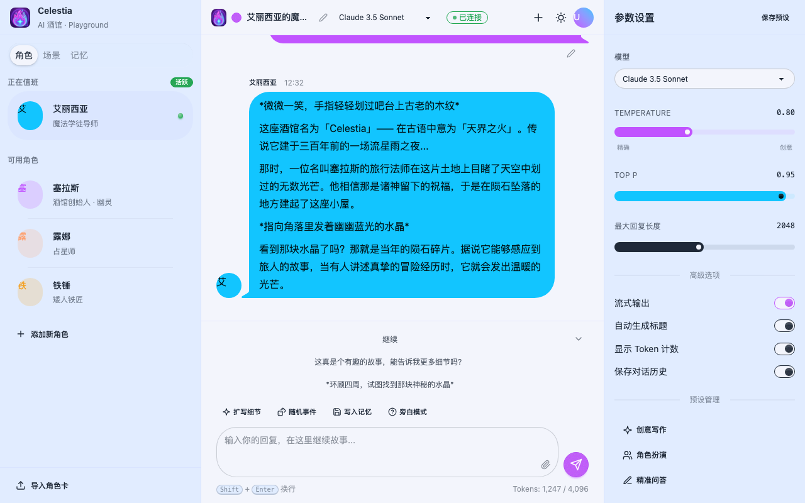
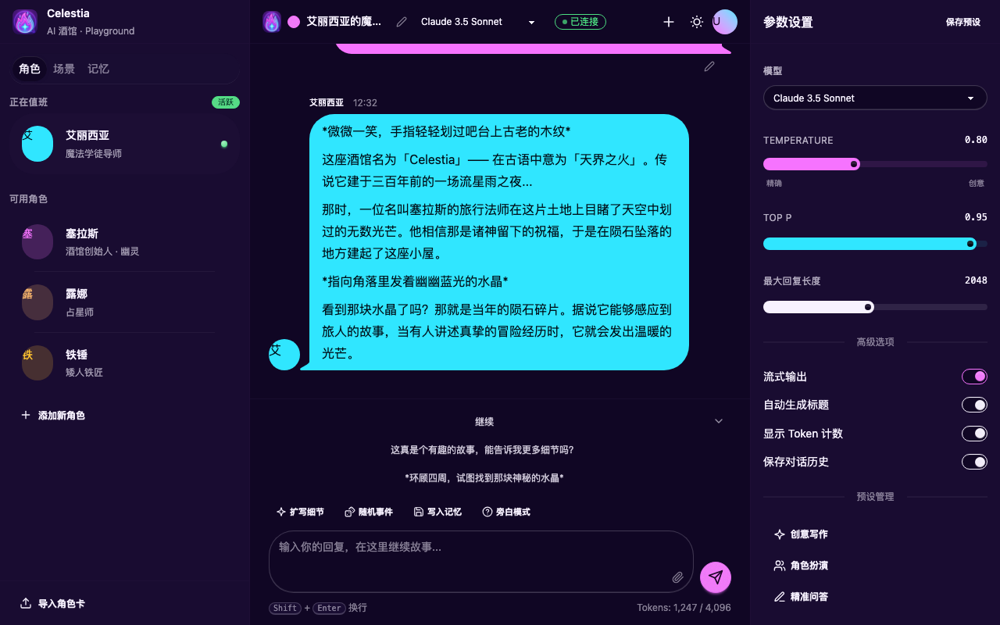
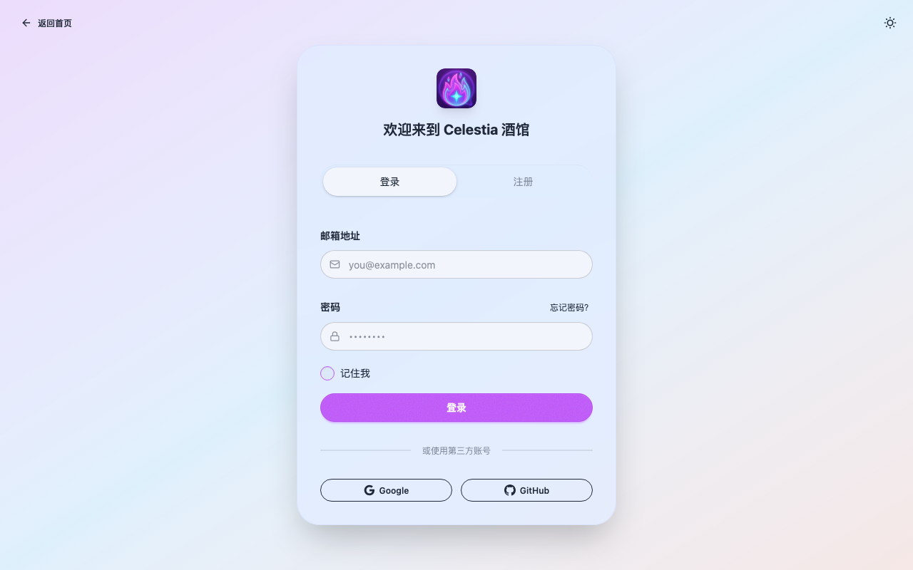
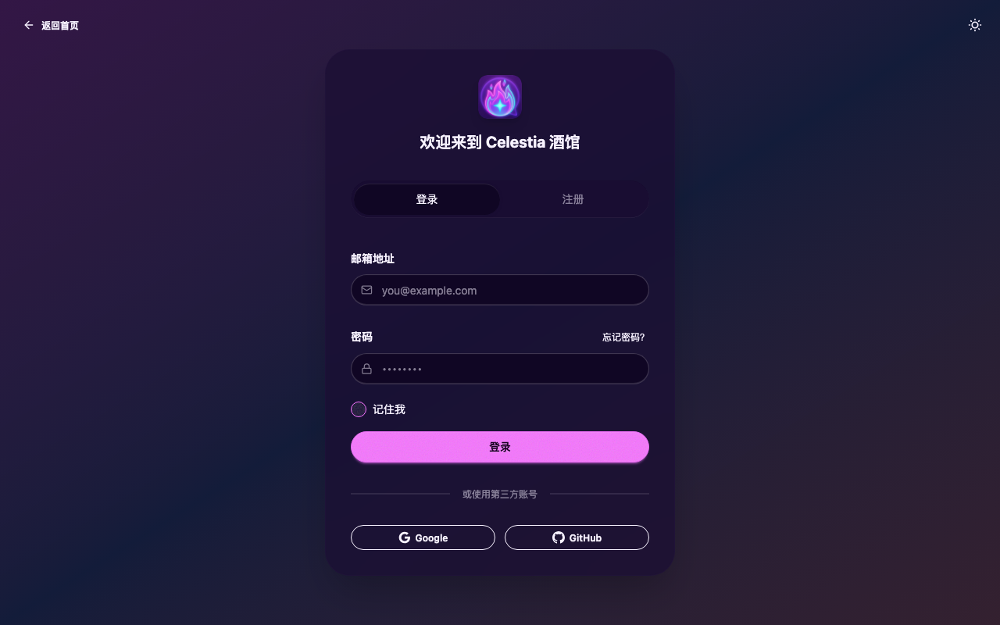
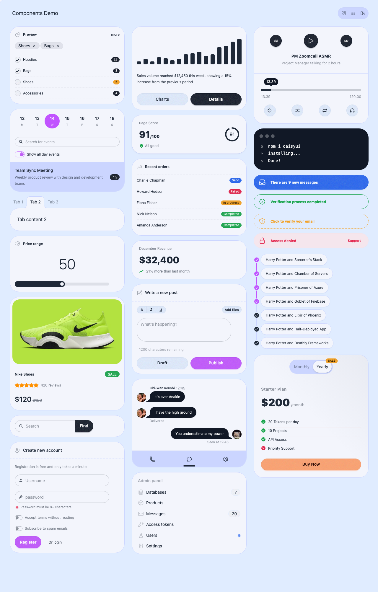
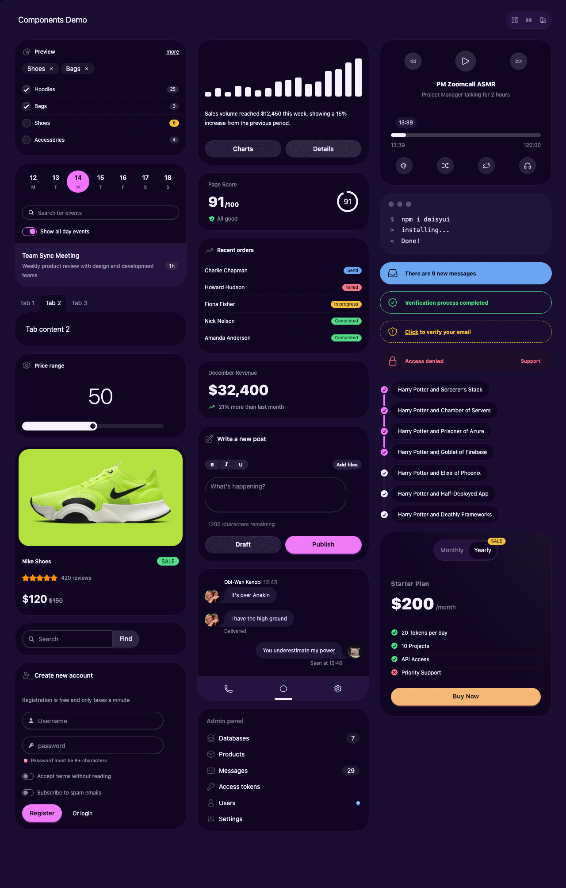

# Celestia UI

<p align="center">
  
</p>

<p align="center">
  <strong>🌙 AI 魔法酒馆 · LLM Playground</strong>
</p>

<p align="center">
  一个现代化的 AI 聊天界面，结合 SillyTavern 风格的强大功能与优雅的 UI 设计。
</p>

<p align="center">
  <a href="#功能特性">功能特性</a> •
  <a href="#技术栈">技术栈</a> •
  <a href="#快速开始">快速开始</a> •
  <a href="#截图展示">截图展示</a> •
  <a href="#许可证">许可证</a>
</p>

---

## ✨ 功能特性

- 🎭 **角色管理** - 创建和管理多个 AI 角色，每个角色都有独特的人设、语气和记忆
- 🌍 **世界信息** - 构建复杂的世界观设定，让 AI 能够理解并在对话中运用这些知识
- 🧠 **记忆系统** - 智能记忆管理，让 AI 能够记住重要的对话内容和事件
- 🤖 **多模型支持** - 支持 OpenAI、Claude、本地模型等多种 AI 后端，自由切换
- ⚙️ **参数预设** - 保存和加载不同的模型参数配置，快速切换创作风格
- 🔌 **扩展生态** - 支持插件扩展，连接 TTS、图像生成等外部服务
- 🌓 **主题切换** - 精心设计的亮色/暗色主题，支持一键切换
- 📱 **响应式设计** - 完美适配桌面端和移动端设备

## 🛠️ 技术栈

- **[Tailwind CSS 4](https://tailwindcss.com/)** - 原子化 CSS 框架
- **[daisyUI 5](https://daisyui.com/)** - Tailwind CSS 组件库
- **[Stimulus](https://stimulus.hotwired.dev/)** - 轻量级 JavaScript 框架
- **[Vite](https://vitejs.dev/)** - 下一代前端构建工具
- **[Lucide Icons](https://lucide.dev/)** - 精美的图标库

### 自定义主题

项目包含两套精心设计的 daisyUI 主题：

- **Celestia Dawn** (浅色) - 柔和的蓝紫色调，温暖舒适
- **Celestia Night** (深色) - 深邃的紫色夜空，神秘优雅

## 🚀 快速开始

### 环境要求

- Node.js >= 18
- pnpm (推荐) 或 npm

### 安装

```bash
# 克隆仓库
git clone https://github.com/your-username/celestia-ui.git
cd celestia-ui

# 安装依赖
pnpm install

# 启动开发服务器
pnpm dev
```

### 构建

```bash
# 构建生产版本
pnpm build

# 预览生产版本
pnpm preview
```

## 📸 截图展示

### 首页

<table>
  <tr>
    <td align="center">
      
      <br>
      <em>浅色主题</em>
    </td>
    <td align="center">
      
      <br>
      <em>深色主题</em>
    </td>
  </tr>
</table>

### 聊天界面

<table>
  <tr>
    <td align="center">
      
      <br>
      <em>浅色主题</em>
    </td>
    <td align="center">
      
      <br>
      <em>深色主题</em>
    </td>
  </tr>
</table>

### 登录页面

<table>
  <tr>
    <td align="center">
      
      <br>
      <em>浅色主题</em>
    </td>
    <td align="center">
      
      <br>
      <em>深色主题</em>
    </td>
  </tr>
</table>

### 组件展示

<table>
  <tr>
    <td align="center">
      
      <br>
      <em>浅色主题</em>
    </td>
    <td align="center">
      
      <br>
      <em>深色主题</em>
    </td>
  </tr>
</table>

## 📁 项目结构

```
celestia-ui/
├── public/                 # 静态资源
│   ├── favicon.ico
│   ├── favicon.png
│   └── logo.png
├── src/
│   ├── assets/
│   │   └── application.css # 主样式文件 (Tailwind + daisyUI 配置)
│   ├── components/         # 组件演示页面
│   │   ├── index.html
│   │   ├── palette.html
│   │   ├── tab.html
│   │   ├── toast.html
│   │   └── variants.html
│   ├── js/
│   │   ├── application.js  # JavaScript 入口
│   │   └── controllers/    # Stimulus 控制器
│   │       ├── drawer_controller.js
│   │       ├── panel_switcher_controller.js
│   │       ├── playground_controller.js
│   │       ├── quick_replies_controller.js
│   │       ├── theme_controller.js
│   │       └── toast_controller.js
│   ├── index.html          # 首页
│   ├── login.html          # 登录页
│   └── playground.html     # 聊天界面
├── screenshots/            # 截图
├── package.json
├── vite.config.js
└── README.md
```

## 🎨 主题定制

主题配置位于 `src/assets/application.css`，你可以根据需要自定义颜色：

```css
@plugin "daisyui/theme" {
  name: "your-theme";
  default: true;
  color-scheme: light;

  --color-primary: oklch(66% 0.25 310.13);
  --color-secondary: oklch(77% 0.15 229.34);
  --color-accent: oklch(79% 0.13 48.50);
  /* ... 更多颜色配置 */
}
```

访问 [daisyUI Theme Generator](https://daisyui.com/theme-generator/) 可视化创建自定义主题。

## 📄 许可证

本项目采用 [MIT 许可证](LICENSE) 开源。
